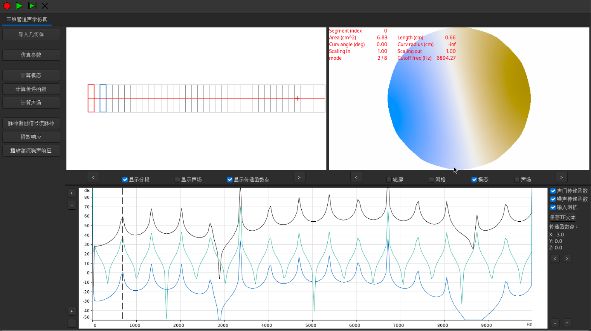

# PipeSonic: 集成化三维管道声学仿真平台

PipeSonic 是一款旨在简化和加速复杂管道及腔体系统声学特性分析的集成软件平台。它整合了强大的三维几何处理能力与专业的声学仿真内核，提供了一个从模型导入到最终声学特性分析的一站式工作流程。

本平台的核心架构是将 VTL3d 声学分析软件深度集成到定制的 3D Slicer 版本 (miniSlicer) 中，通过一个名为 `VTL3dViewer` 的C++ Loadable Module 实现。

## PipeSonic 主要功能

*   **几何处理与管腔提取**:
    *   支持导入标准STL等三维模型文件。
    *   内置强大的分割工具 (Segment Editor)，能够从实体模型中精确提取内部流体域（管腔）。
    *   自动生成管腔的几何中心线 (ExtractCenterline)，并支持用户通过集成的Markups模块进行编辑。
    *   沿中心线提取横截面轮廓，并导出为CSV格式，作为声学仿真的几何输入。

*   **声学仿真与分析 (由集成的VTL3d内核提供)**:
    *   基于有限元法 (FEM) 对导入的截面数据重建的几何进行声学计算。
    *   提供用户友好的界面 (通过嵌入VTL3d原生GUI)，用于设置流体介质属性、声学边界条件、壁面特性和激励源等。
    *   **核心求解能力**:
        *   计算管道/腔体的声学模态（固有频率和模态振型）。
        *   进行声学响应分析，获取传递函数、声场分布等。

*   **可视化与后处理**:
    *   利用miniSlicer平台强大的可视化能力，实时显示三维几何模型、中心线、截面及网格。
    *   结合VTL3d的绘图功能，以云图、曲线图等多种形式可视化声学仿真结果。

## PipeSonic 工作流程概览

1.  **导入与几何准备**: 在PipeSonic中导入管道的STL模型，利用Segment Editor提取内部管腔，并使用ExtractCenterline生成中心线。
2.  **截面数据生成**: 沿中心线提取一系列横截面，并将轮廓数据导出为CSV文件。
3.  **声学模型设置**: 在嵌入的VTL3d界面中导入CSV几何数据，设定仿真所需的材料参数、边界条件等。
4.  **仿真计算**: 运行声学模态分析或响应分析。
5.  **结果可视化与分析**: 查看计算得到的模态频率、振型图、传递函数曲线等。

## 功能验证示例

下图展示了一个基础的验证案例，将PipeSonic的计算结果与理论分析进行了对比，初步验证了其模态求解器的准确性。



*图：直径29.5mm圆管的声学特性分析。图中可能包含传递函数曲线，并以竖线标示了理论计算的第一个高阶模态截止频率(\(\approx\) 6.9 kHz)，显示了PipeSonic仿真结果与理论及一维模型预测趋势的一致性。*

## 当前开发状态与核心任务

目前，PipeSonic的开发工作集中在**通过 C++ Loadable Module (`VTL3dViewer`) 完美嵌入 VTL3d 的原生 wxWidgets GUI**。

**已完成**:
*   VTL3d 的 wxWidgets GUI 部分已编译为独立的共享库 (`libVTL3dGui.so`)，并暴露了用于创建其主窗口QWidget封装的工厂函数。
*   `VTL3dViewer` 模块的C++骨架已搭建完毕，能够成功编译，并已配置为在miniSlicer构建时链接 `libVTL3dGui.so`。

**下一步核心任务 (GUI 嵌入)**:
在 `qSlicerVTL3dViewerModuleWidget` 中实现 VTL3d GUI 的实际嵌入，主要步骤包括：
1.  **动态加载 `libVTL3dGui.so`**: 使用 `QLibrary`。
2.  **解析工厂函数符号**: 获取 `CreateVTL3dMainWindow` 函数地址。
3.  **调用工厂函数并嵌入 GUI**: 将返回的 `QWidget*` (VTL3d主窗口封装) 添加到 `VTL3dViewer` 模块的布局中。
4.  **库生命周期管理**: 确保共享库在模块界面存在期间保持加载。
5.  **错误处理**: 为库加载、符号解析等失败情况提供提示。

## 编译与测试步骤 (当前开发阶段)

为继续GUI嵌入的开发工作或验证当前构建状态：

1.  **确保顶层 `miniSlicer/CMakeLists.txt` 中已移除对旧 `VTL3D_1.0` 路径的 `add_subdirectory` 调用。**
2.  **清理构建目录 (强烈建议)**:
    ```bash
    rm -rf ./build/build-mini
    ```
3.  **重新配置 CMake (使用 nix 环境)**:
    ```bash
    nix develop
    configure_slicer_mini ./miniSlicer ./build/build-mini ./build/install-mini
    ```
4.  **构建项目**:
    ```bash
    cd ./build/build-mini && make -j$(nproc)
    ```

完成 GUI 嵌入后，PipeSonic将进一步开发miniSlicer场景与嵌入的VTL3d GUI之间的数据交互功能，最终实现一个功能完善的集成化声学仿真平台。

## 目标用户

PipeSonic旨在为从事HVAC系统设计、消声器与排气系统声学优化、乐器声学研究以及其他涉及管道和腔体声学行为分析的工程师和科研人员提供一个便捷、高效的仿真工具。

我们欢迎社区的反馈和贡献，共同推动PipeSonic成为管道声学分析领域的优秀开源解决方案。
