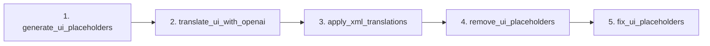

# miniSlicer UI 翻译流水线技术报告

> 作者：自动生成
> 日期：$(date)

---

## 一、场景与目标

* **场景**：miniSlicer 项目包含数千个 Qt Designer 生成的 `.ui` 文件，需要将界面文字由英文批量翻译为中文。
* **目标**：
  1. 在 **全离线 / 本地仓库** 条件下完成文本抽取、调用 LLM 翻译、写回文件，并保证 XML 格式合法。  
  2. **最小侵入**：原始文件仅在最后一步被覆盖；中间过程使用临时目录，方便回滚。  
  3. **可持续迭代**：脚本可重复执行，支持后续 UI 变动的增量翻译；流水线易复用到其他格式或项目。

## 二、总体流程



| 步骤 | 入口脚本 | 核心职责 |
|------|-----------|-----------|
| 1 | `generate_ui_placeholders.py` | 递归扫描 `.ui` 文件，对需要翻译的 `<string>` 节点加上占位符 `¥0000000123¥ ` 并复制到 `tmp_ui/`；同时拼接大文件 `all_strings_tagged.txt` 供 LLM 输入。 |
| 2 | `translate_ui_with_openai.py` | 以 **System Prompt + 大文件** 分块调用 OpenAI（可指定 `--base_url` 代理），生成 sed 风格的替换脚本 `replace.sh`。 |
| 3 | `apply_xml_translations.py` | 解析 `replace.sh`，将中文文本填充回 `tmp_ui/` 下对应节点，并按原相对路径写到源码目录。 |
| 4 | `remove_ui_placeholders.py` | 在 `tmp_ui/` 阶段去掉占位符后缀，保证写回的 XML 已无标识符。 |
| 5 | `fix_ui_placeholders.py` | **兜底**：在真正源码树再扫一次，防止极端情况残留占位符。 |

Makefile 目标：

```
$ make -C script all      # = translate
$ make -C script clean    # 删除 tmp_ui 等临时产物
$ make -C script monitor  # 查看 OpenAI token 等
$ make -C script fix      # 单独运行最后修复步骤
```

## 三、关键技术拆解

### 1. 占位符标记策略

* 采用稀有字符 **"¥"** 作为包围，宽度固定 `ID_WIDTH=10`，形如 `¥0000000123¥ `。  
* 好处：
  * 正则匹配简单，`^¥\d{10}¥\s?` 可定位到行首占位符；  
  * 避免与 UI 本身 UTF-8 中文产生冲突。  
* `id_map.jsonl` 预留 ID ↔ 文件路径映射，便于后期追踪。

### 2. LLM 翻译交互

* **Prompt Engineering**：System Prompt 以「你是一位医学影像软件本地化专家….」约束风格。
* **块切分**：`CHUNK_SIZE` 控制最大字符数；脚本自动拆分 & 合并结果。
* **安全回写**：并不直接 `sed` 替换，而是解析为字典再用 XML DOM 写入，降低格式破坏风险。

### 3. 结构化写回

* 使用 `xml.etree.ElementTree` 解析 / 输出，保持属性顺序与缩进。
* 在 `apply_xml_translations.py` 中仅当节点被修改时才写文件，减少无意义 diff。

### 4. 校验与回滚

* **xmllint**：若本地有安装，自动校验翻译后所有 `.ui` ，保证文件合法。
* **tmp_ui/**：完整保存带占位符的中间 UI，可在出现问题时手动对比差异。
* **fix_ui_placeholders.py**：最终保险，确保仓库无占位符字符串。

## 四、方法论抽象

本流水线可抽象为以下通用模式，可迁移到其他文本或结构化文件批翻场景：

1. **可逆标记（Tagging）**  
   在待翻译文本两侧加唯一占位符 → 建立 ID ↔ 位置映射。对任何格式（XML/JSON/YAML/Markdown）均适用。
2. **大文件拼接（Concatenate）**  
   按需把所有带标记文件拼成 LLM 输入，解决上下文 & 截断问题。
3. **LLM 翻译（Translate）**  
   分块调用模型，输出统一格式的替换指令或 JSON 字典。
4. **结构化应用（Apply）**  
   解析替换结果 → 遍历原文件结构，精准写回。
5. **标记清理（Cleanup）**  
   移除占位符；如有必要再全局扫描兜底。
6. **校验 & 监控（Verify & Monitor）**  
   结合格式校验器 / lint、token 监控脚本提高稳定性与成本可见性。

> **关键思想**：始终保持"一条可追溯的数据流"——从标记到翻译再到清理，任何阶段失败都可依据临时产物快速定位。

## 五、可迁移示例

| 场景 | 替换文件格式 | 标记节点示例 |
|------|--------------|-------------|
| Vue i18n | `.vue` / `.ts` | `t('¥0000001¥ Hello')` |
| JSON 配置 | `.json` | `"title": "¥0000023¥ My Title"` |
| Markdown 文档 | `.md` | `> ¥0000042¥ Some sentence` |
| Slicer .xml 模块描述 | `.xml` | 与本例类似 |

通过替换 **解析器 + 写回器**（XML → JSON / AST / Markdown parser），即可快速复用。

## 六、后续改进方向

1. **增量翻译**：基于 git diff 仅重新标记新增英文文本。
2. **Prompt 动态优化**：根据历史翻译质量自动调整 style guide。
3. **多语言支持**：占位符阶段可记录目标语言代码，支持一次生成多语种。
4. **CI 集成**：在 PR workflow 中自动跑 `make translate` 并提交翻译结果评论。

---

> 如有问题或改进建议，欢迎提交 Issue ✉️  